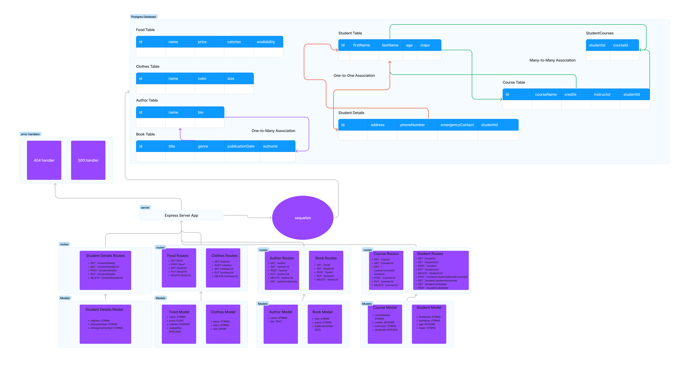
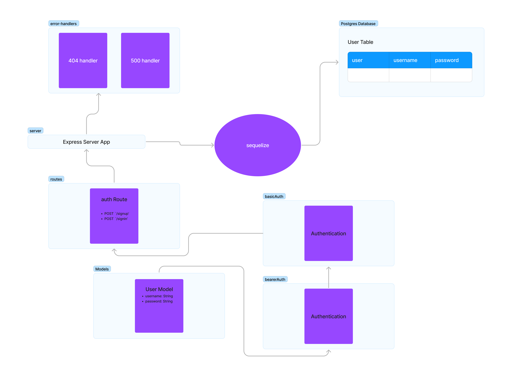

# LAB - Class 08

## Project: AUTH-API

### Author: Bryan O. Garduno Gonzalez

### Problem Domain  
    This project involves enhancing the security and functionality of an API server by integrating authentication and authorization features. The task begins with merging two existing servers: an API server that handles CRUD operations and an Auth server responsible for user management and authentication. The unified server should support key routes like user signup, signin, and token-validated accesses. The core of the project is to establish role-based access control (RBAC), defining different levels of permissions for users, writers, editors, and administrators, each with increasing levels of access from reading to full CRUD capabilities.

    The second phase of the project focuses on developing a new set of API routes (Version 2) that are protected based on user roles and permissions, using Bearer Authentication and an Access Control List (ACL). This includes ensuring that only authenticated users with the appropriate permissions can access specific operations like create, update, or delete. The project also mandates code refinement, transitioning to modern async/await syntax, robust error handling, and thorough testing of both authentication routes and versioned API routes. The ultimate goal is to create a secure and efficient API server with clear, role-defined access to resources.

### Links and Resources

- [GitHub Actions ci/cd](https://github.com/brosmar18/auth-api2.0/actions) 
- Dev [Back-end server Dev Branch url]()
- Main [back-end server main branch url]()

### Collaborators

  
### Setup

#### `.env` requirements (where applicable)

A .env file is included in local repository. A .env-sample file is uploaed to the remote repo so collaborators understand what environmental variables are being used. 

#### How to initialize/run your application (where applicable)

- e.g. `npm start`

#### How to use your library (where applicable)

## Features / Routes

The API server features several routes, each serving a different purpose and having specific access control based on user roles. The following is a summary of these routes:

### General Routes
- **GET /**: Returns a simple "Hello World!" message, indicating that the server is running.
- **GET /error**: A test route to trigger a 500 error, useful for testing error handling.

### Authentication Routes
- **POST /signup**: Allows new users to sign up. On successful signup, it returns the user object and a JWT token.
- **POST /signin**: Enables users to sign in using basic authentication. On successful signin, it returns the user object and a JWT token.

### User-Specific Routes
- **GET /users**: Accessible to users with 'delete' permissions (typically admins). It returns a list of all usernames.

### Secret Area Route
- **GET /secret**: A protected route that requires bearer token authentication, displaying a secret message upon successful access.

### Course Management Routes
- **POST /course**: Allows creation of a new course. Accessible to users with 'create' permissions. Returns details of the newly created course.
- **GET /course**: Retrieves all courses. Requires 'read' permissions.
- **PUT /course/:id**: Updates a specific course identified by its ID. Requires 'update' permissions.
- **DELETE /course/:id**: Deletes a specific course by ID. Accessible to users with 'delete' permissions.

### Middleware
- **Bearer Authentication**: Validates the provided JWT token for most of the routes.
- **Access Control List (ACL)**: Checks if the authenticated user has the required permissions to access specific routes.

These routes collectively enable user registration and login, handling of course data, and access to protected content based on user roles and permissions.

#### Tests

The test suite for this API server is comprehensive, covering a wide range of functionalities including general server responses, authentication processes, CRUD operations on various models, and access control based on user roles. Here's a breakdown of the tests and their significance:

- **General Server Tests**:
  - Validates that the root path (`/`) responds with "Hello World!" and a 200 status code.
  - Ensures that invalid routes return a 404 status code.
  - Checks the server's error handling capability by triggering a forced error, expecting a 500 status code.

- **Authentication Tests**:
  - Verifies the user creation process, checking if the user is correctly added to the database with hashed passwords and valid JWT tokens.
  - Confirms user authentication through the `/signin` route, validating successful login with correct credentials and denial of access with incorrect credentials.

- **Collection Class Methods Tests**:
  - Tests the functionality of creating, reading (both single and all records), updating, and deleting records in the database, including error handling for each operation.

- **Course Routes Tests**:
  - Examines the `/course` routes, ensuring that users with different roles (like admin and regular user) have the appropriate access to create, read, update, and delete courses.

- **User Route Tests**:
  - Focuses on the `/users` route, asserting that only users with 'delete' permission (typically admins) can retrieve a list of users, and users without such permission are denied access.

### Running the Tests:
To run the tests, use the command `npm test` in your terminal. Ensure that your testing environment is correctly set up, including any necessary database configurations.

### Notable Observations:
- The tests for user creation and authentication are crucial as they ensure the system's integrity in handling user credentials and access tokens.
- The Collection class tests are significant for validating the core CRUD functionality and robust error handling in the database interaction layer.
- The role-based access control tests in the `/course` and `/users` routes are vital for confirming that the application correctly implements authorization.

### Incomplete or Skipped Tests:
- As of now, all essential tests have been implemented and passed successfully. There are no incomplete or skipped tests in the current test suite. Future enhancements may include more detailed edge-case testing and performance testing under various load conditions.

#### UML

;
;
